# PINNED. by ESN — Responsive Product Landing Page

A responsive product landing page developed for **ITST 302 – Client-Server Technologies, Week 5 Laboratory Activity**.

The project features **Pinned by ESN**, a small button pin business based in Pila, Laguna. The website showcases the business's products, pricing, ordering process, customer feedback, and contact information through a responsive interface built with **Laravel, Blade Components, and Tailwind CSS**.

> **Tagline:** Pinning your ideas to life.

---

## Project Overview

The goal of this project is to design and develop a modern product landing page that adapts effectively across desktop, laptop, tablet, and mobile devices.

The website presents the products and services offered by Pinned by ESN, including:

- Mystery Pins
- Pre-Designed Pins
- Custom Pins
- Commissioned Pins
- Bulk Orders
- Multiple finishes and add-ons

The interface uses reusable Laravel Blade components and responsive Tailwind CSS utilities to maintain a consistent design throughout the website.

---

## Objectives

This project was developed to:

- Build a fully responsive product landing page using Laravel.
- Apply Tailwind CSS utility classes for responsive layouts and styling.
- Create reusable Blade components for repeated interface elements.
- Implement mobile-first responsive design principles.
- Present real product information from a small business.
- Improve accessibility through semantic HTML, alternative text, labels, and ARIA attributes.
- Apply basic SEO practices using page titles and meta descriptions.
- Maintain a clean and organized Laravel project structure.
- Use Git and GitHub for version control with meaningful commits.

---

## Technologies Used

| Technology | Purpose |
|---|---|
| Laravel | Web application framework and project structure |
| Blade | Laravel templating and reusable UI components |
| Tailwind CSS | Responsive styling and utility-based design |
| JavaScript | Mobile navigation interaction |
| Vite | Front-end asset development and production build |
| Git | Version control |
| GitHub | Source code repository and project documentation |
| Visual Studio Code | Development environment |

---

## Responsive Web Design

The website follows a **mobile-first responsive design approach**.

Tailwind CSS breakpoints are used to progressively adapt the interface depending on the available screen size. Layouts, spacing, typography, navigation, product cards, pricing cards, and other interface elements change according to the device width.

The website was tested using multiple viewport sizes, including:

- Desktop
- Laptop
- Tablet / iPad
- Mobile / Smartphone

### Desktop View

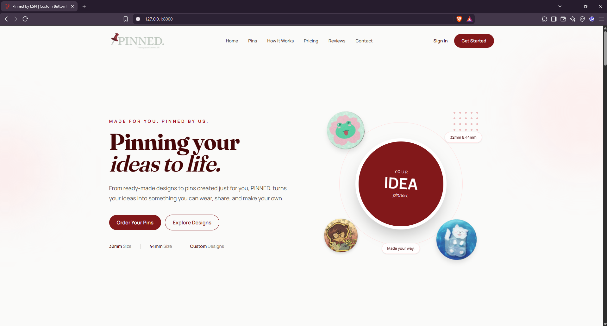

### Tablet View

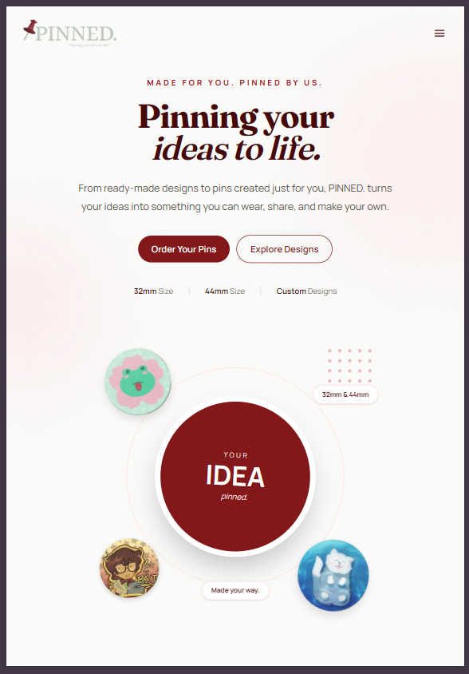

### Mobile View

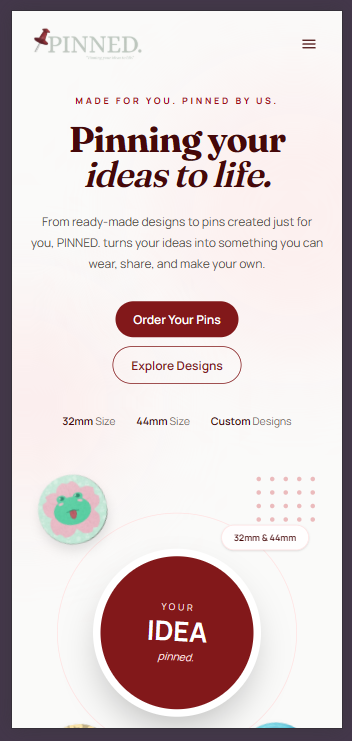

---

## Tailwind CSS Implementation

Tailwind CSS is used throughout the project instead of traditional large custom stylesheets.

Responsive utility classes are used for:

- Grid layouts
- Flexbox layouts
- Responsive typography
- Padding and margins
- Navigation visibility
- Card layouts
- Button states
- Responsive images
- Mobile and desktop alignment
- Hover and transition effects

Examples of responsive Tailwind utilities used in the project include:

```text
sm:
md:
lg:
grid
flex
hidden
lg:flex
md:grid-cols-2
lg:grid-cols-3
max-w-7xl
mx-auto
```

These utilities allow the interface to adapt without creating separate layouts for each device.

---

## Laravel Blade Components

Reusable Blade components were created to reduce duplicated markup and maintain consistent styling.

The project contains components such as:

```text
resources/views/components/
├── button.blade.php
├── cta.blade.php
├── feature-card.blade.php
├── features.blade.php
├── footer.blade.php
├── hero.blade.php
├── navbar.blade.php
├── order-process.blade.php
├── pricing-card.blade.php
├── pricing.blade.php
├── product-showcase.blade.php
├── testimonial-card.blade.php
└── testimonials.blade.php
```

Examples of reusable components include:

### Button Component

Used for consistent call-to-action buttons throughout the website.

### Feature Card Component

Used to display product types and services using a consistent card structure.

### Pricing Card Component

Used for the Pre-Designed, Custom, and Commissioned pricing options.

### Testimonial Card Component

Used to display customer feedback with customer images and information.

---

## User Interface Design

The visual design was created around the branding of **Pinned by ESN**.

The interface uses:

- Burgundy and red as primary brand colors
- Warm off-white backgrounds
- Soft pink accents
- Serif display typography for headings
- Clean sans-serif typography for body content
- Rounded cards and buttons
- Subtle shadows
- Decorative background elements
- Actual product and customer images

The design was refined from a basic initial layout into a more polished and brand-focused responsive interface.

---

## Website Sections

### 1. Navigation Bar

The responsive navigation bar contains:

- Business logo
- Home
- Pins
- How It Works
- Pricing
- Reviews
- Contact
- Sign In
- Get Started

Desktop devices display the complete navigation, while smaller screens use a hamburger menu.

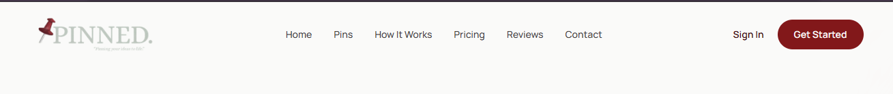

---

### 2. Hero Section

The hero section introduces the business using the tagline:

> **Pinning your ideas to life.**

It includes:

- Business introduction
- Order Your Pins CTA
- Explore Designs CTA
- Pin size information
- Custom design information
- Real product imagery

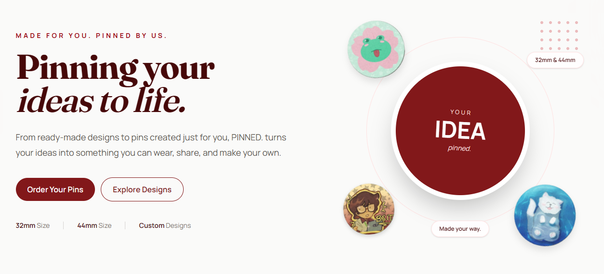

---

### 3. Product Features

The website presents six major product options:

1. Mystery Pins
2. Pre-Designed Pins
3. Custom Pins
4. Commissioned Pins
5. Bulk Orders
6. Finishes & Styles

Each feature uses a custom icon and reusable feature card.

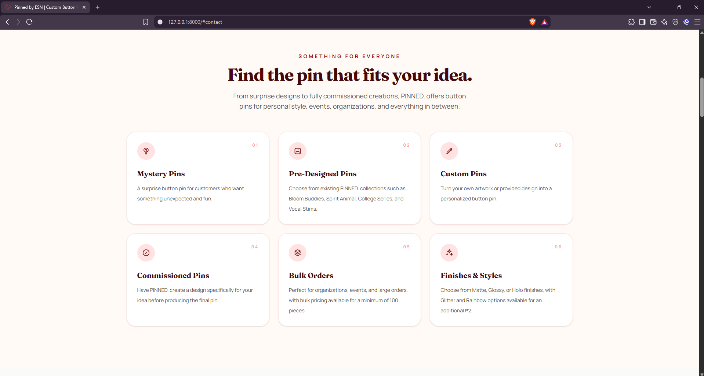

---

### 4. Product Showcase

The product showcase displays actual Pinned by ESN collections:

- Bloom Buddies
- Spirit Animal
- College Series
- Vocal Stims

It also includes a visual concept for customized pin creation with both desktop and mobile previews.

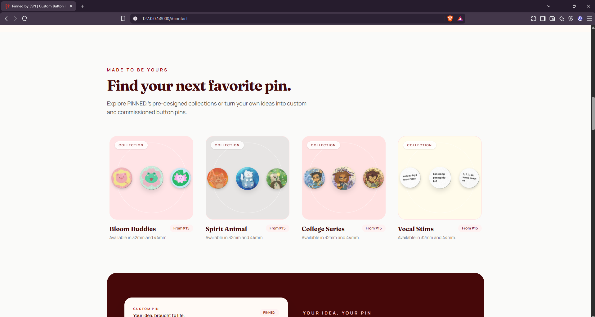

---

### 5. Ordering Process

The website explains the customer ordering process through five steps:

1. Contact Us
2. Choose Your Pin
3. Confirm Details
4. We Make It
5. Delivery

The section also communicates the general **7-day pre-order basis** and supported payment methods.

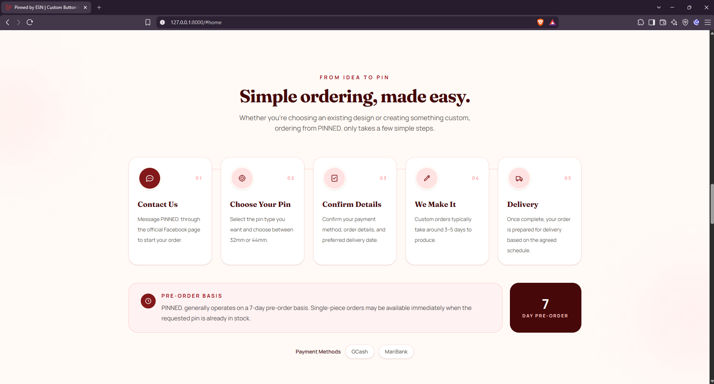

---

### 6. Pricing

Three primary pricing options are presented:

- Pre-Designed
- Custom
- Commissioned

The website also provides:

- 32mm and 44mm pricing
- Bulk order rates
- Packaging options
- Finish options
- Glitter and Rainbow add-ons

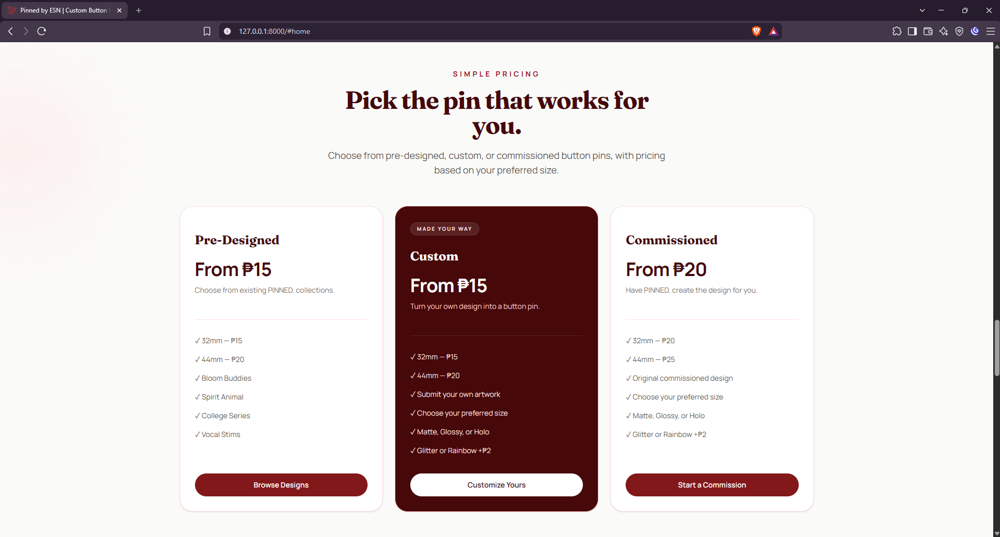

---

### 7. Customer Testimonials

Real customer feedback is displayed using reusable testimonial cards with customer images.

The testimonials provide social proof while maintaining the visual identity of the website.

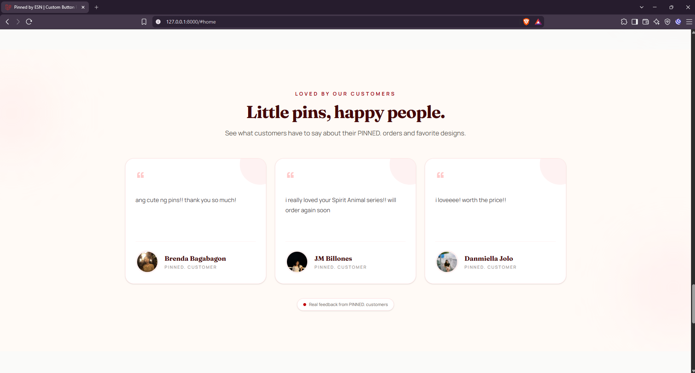

---

### 8. Call to Action

The final call-to-action section encourages customers to contact Pinned by ESN through its Facebook page or review the available pricing options.

---

### 9. Footer

The footer provides:

- Business branding
- Quick navigation links
- Product links
- Business location
- Phone number
- Email address
- Facebook
- Instagram
- Messenger

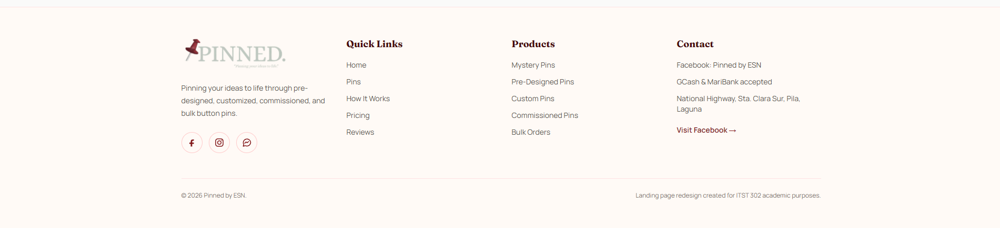

---

## Sign In Interface Preview

A responsive Sign In interface was added as a preview of a possible future customer portal.

The page is accessible through:

```text
/signin
```

The interface includes email and password fields while clearly identifying the customer portal as **Coming Soon**.

Authentication is intentionally not implemented because the scope of this activity focuses on the responsive product landing page and interface design.

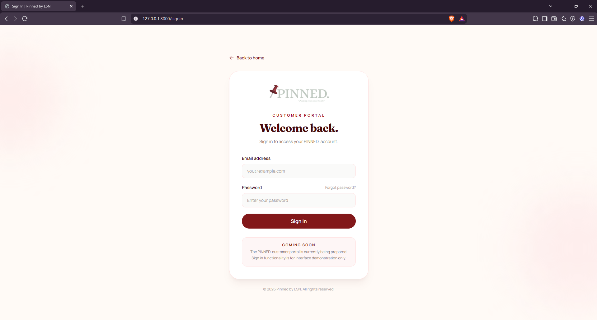

---

## Accessibility

Several accessibility practices were applied throughout the website:

- Semantic HTML elements
- Descriptive image `alt` attributes
- Form labels
- `aria-label` attributes where appropriate
- `aria-expanded` and `aria-controls` for the mobile navigation
- Keyboard-accessible links and buttons
- Readable text contrast
- Responsive text sizing

---

## SEO

Basic SEO practices were implemented through the main Laravel layout.

These include:

- Descriptive page titles
- Meta descriptions
- Semantic heading structure
- Meaningful page content
- Descriptive image alternative text

Example:

```html
<meta
    name="description"
    content="Pinned by ESN creates custom and pre-designed button pins for individuals, organizations, and events."
>
```

---

## Project Structure

The main files used by the landing page are organized as follows:

```text
week05-product-landing-page/
├── app/
├── documentation/
├── public/
│   └── images/
│       ├── logo/
│       ├── pin-designs/
│       └── testimonials/
├── resources/
│   ├── css/
│   │   └── app.css
│   ├── js/
│   │   └── app.js
│   └── views/
│       ├── components/
│       ├── layouts/
│       │   └── app.blade.php
│       └── pages/
│           ├── home.blade.php
│           └── signin.blade.php
├── routes/
│   └── web.php
├── screenshots/
├── README.md
└── vite.config.js
```

### Project Structure in Visual Studio Code

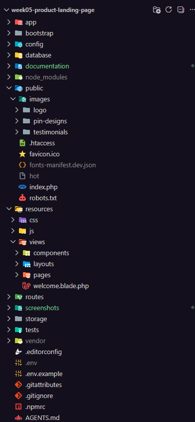

### Blade Components

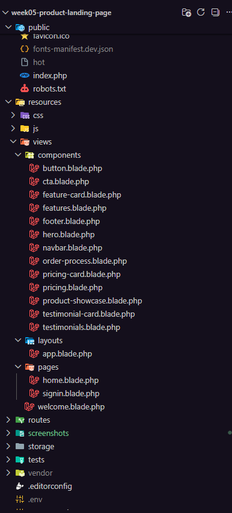

---

## Before and After

The interface was developed through an iterative design process.

The initial version focused on establishing the required structure and responsive sections. The final version improved the visual identity, product presentation, typography, spacing, responsiveness, and overall consistency.

### Before

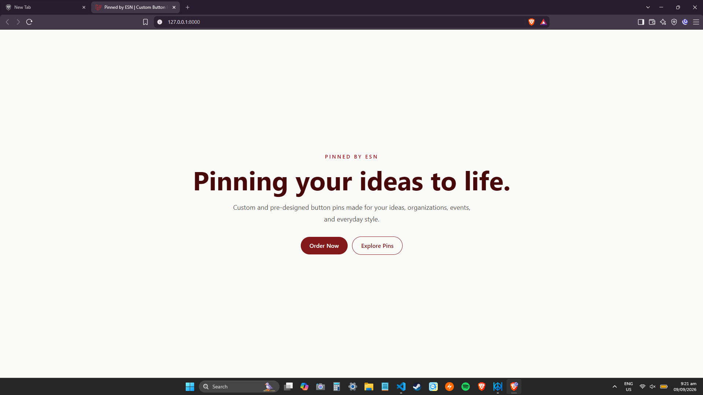

### After

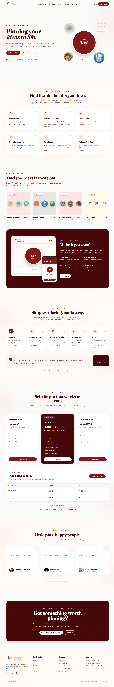

The final interface incorporates the actual business logo, real product imagery, customer testimonials, improved typography, responsive layouts, and a more cohesive visual identity.

---

## Problems Encountered and Solutions

### 1. Responsive Hero Alignment

**Problem:**  
The hero content appeared slightly left-aligned on tablet-sized screens even though the layout was intended to be centered below the desktop breakpoint.

**Solution:**  
The content container was centered using responsive width and margin utilities while preserving left alignment for large screens.

```html
mx-auto w-full max-w-2xl text-center lg:mx-0 lg:text-left
```

---

### 2. Mobile Navigation

**Problem:**  
The complete desktop navigation could not fit properly on smaller screens.

**Solution:**  
A responsive hamburger menu was implemented using Tailwind visibility utilities and JavaScript. ARIA attributes were also used to improve accessibility.

---

### 3. Repetitive Interface Elements

**Problem:**  
Cards and buttons required similar markup and styling across multiple sections.

**Solution:**  
Reusable Blade components were created for buttons, features, pricing, and testimonials to reduce duplication and maintain visual consistency.

---

### 4. Responsive Product Showcase

**Problem:**  
The customized pin preview needed to remain understandable across desktop, tablet, and mobile devices.

**Solution:**  
Responsive Tailwind layouts were used to reorganize the showcase depending on the viewport. A mobile preview was also included to demonstrate how the interface adapts to smaller devices.

---

### 5. Consistent Pricing Card Heights

**Problem:**  
Different amounts of text caused pricing cards and their CTA buttons to become uneven.

**Solution:**  
Flexbox utilities such as `flex`, `flex-col`, `h-full`, and `flex-1` were used to maintain equal card heights and align the CTA buttons.

---

### 6. Nonfunctional Sign In Action

**Problem:**  
The navigation requirement included a Sign In action, but implementing a complete authentication system was outside the scope of the product landing page activity.

**Solution:**  
A responsive customer portal preview was created. The page demonstrates the intended Sign In interface while clearly communicating that the portal functionality is still coming soon.

---

## Version Control

Git was used throughout development to track changes and maintain a meaningful project history.

Development was divided into logical commits for:

- Initial Laravel setup
- Navigation
- Hero section
- Product features
- Product showcase
- Ordering process
- Pricing
- Testimonials
- CTA and footer
- Product and customer assets
- Responsive improvements
- Branding improvements
- UI refinements
- Sign In interface preview


```markdown
### GitHub Repository

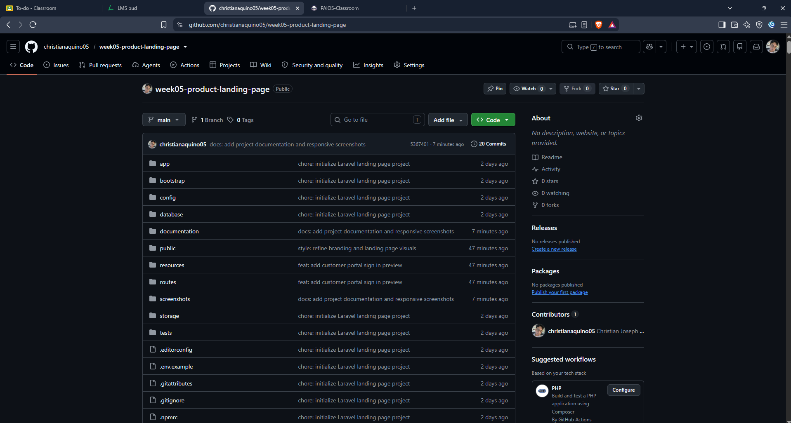

**Repository Link:**  
https://github.com/christianaquino05/week05-product-landing-page

---

## Running the Project Locally

### Requirements

Make sure the following are installed:

- PHP
- Composer
- Node.js and npm
- Git

### Installation

Clone the repository:

```bash
git clone https://github.com/christianaquino05/week05-product-landing-page.git
```

Open the project directory:

```bash
cd week05-product-landing-page
```

Install PHP dependencies:

```bash
composer install
```

Install front-end dependencies:

```bash
npm install
```

Create the environment file:

```bash
cp .env.example .env
```

For Windows PowerShell, you may use:

```powershell
Copy-Item .env.example .env
```

Generate the Laravel application key:

```bash
php artisan key:generate
```

Run the Laravel development server:

```bash
php artisan serve
```

In another terminal, run Vite:

```bash
npm run dev
```

Open:

```text
http://127.0.0.1:8000
```

---

## Reflection

This activity helped me better understand how responsive web design works in an actual Laravel project. Instead of creating separate interfaces for different devices, I learned how Tailwind CSS breakpoints and utility classes can be used to progressively adapt the same interface for desktop, tablet, and mobile screens.

I also gained more experience using reusable Blade components to organize a Laravel project and reduce repeated code. Working with a real small business also made the activity more practical because the design had to present actual products, pricing, branding, and customer information rather than placeholder content.

The iterative development process showed me that responsive design involves more than simply making elements smaller. Layout, spacing, typography, navigation, image placement, readability, and interaction all need to be considered at different viewport sizes.

---

## Business Information

**Pinned by ESN**  
*Pinning your ideas to life.*

**Location:** National Highway, Sta. Clara Sur, Pila, Laguna  
**Instagram:** @pinnedbyesn  
**Phone:** 0956 851 6380  
**Email:** senni.ease@gmail.com

---

## Academic Information

**Course:** ITST 302 – Client-Server Technologies  
**Activity:** Week 5 Laboratory Activity – Responsive Product Landing Page  
**Framework:** Laravel  
**CSS Framework:** Tailwind CSS

---

## Disclaimer

This project was created for academic purposes with permission to use the branding, product information, images, and customer feedback of Pinned by ESN.

The Sign In page is an interface preview only and does not provide functional user authentication.